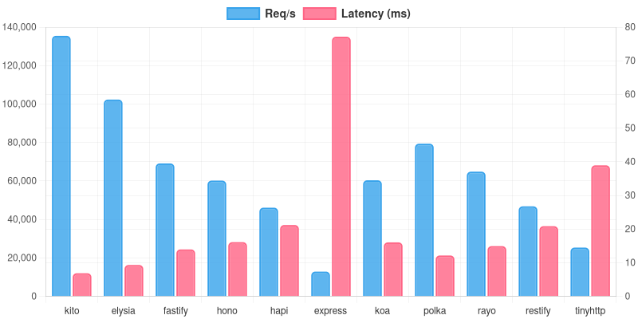

> [!IMPORTANT]
> Kito is still in development and is not available at this time. When this notice is removed, you will know that the framework will be available.

---

<div align="center">


[](https://github.com/kitojs/kito/actions)
[](https://github.com/kitojs/kito/blob/main/LICENSE)
[](https://github.com/kitojs/kito/pulse)
[](https://github.com/kitojs/kito/commits/main)

</div>

Kito is a high-performance backend web framework for TypeScript, written in Rust. It offers an end-to-end type-safe API inspired by **ExpressJS** with optional **tRPC** capabilities. Kito is designed for developers who value performance, simplicity, and flexibility.

```typescript
import { server } from "kitojs"

const app = server();

app.get("/", (req, res) => {
  res.send("Hello, world!");
});

app.listen(3000);
```

---

## ⚡️ Performance

Kito is **the fastest backend framework** in the JavaScript ecosystem. By leveraging the performance of **Rust**, Kito outperforms traditional frameworks like Express by an incredible margin. To put it in perspective: **Kito is +1400% (x15) faster than Express**.



> **Req/s**: Higher is better.  
> **Latency**: Lower is better.

Kito's impressive speed stems from a Rust core that minimizes JavaScript's inherent performance limitations, making it ideal for demanding applications that require **exceptional speed and scalability**. *See more benchmarks [here](./bench).*

For a deeper dive into the internal architecture, check out the full details [here]() and [here]().

---

## 📚 Documentation

Kito offers comprehensive and up-to-date documentation, complete with tutorials, examples, and best practices. Explore everything you need to get started and become proficient at [Kito Documentation](https://kito.pages.dev).

---

## ✍️ Contributing

Interested in contributing? We welcome improvements, bug fixes, and new features! Please refer to our [CONTRIBUTING.md](./CONTRIBUTING.md) for guidelines on how to help us make Kito even better.

#### Honorable Mention

A special thanks to the [RustLangES community](https://github.com/RustLangES) for their early support of this project. They provide a fantastic, welcoming space for Rust developers, whether you're just starting out or already a pro. ❤️

---

## 📄 License

Kito is licensed under the [MIT License](./LICENSE).
