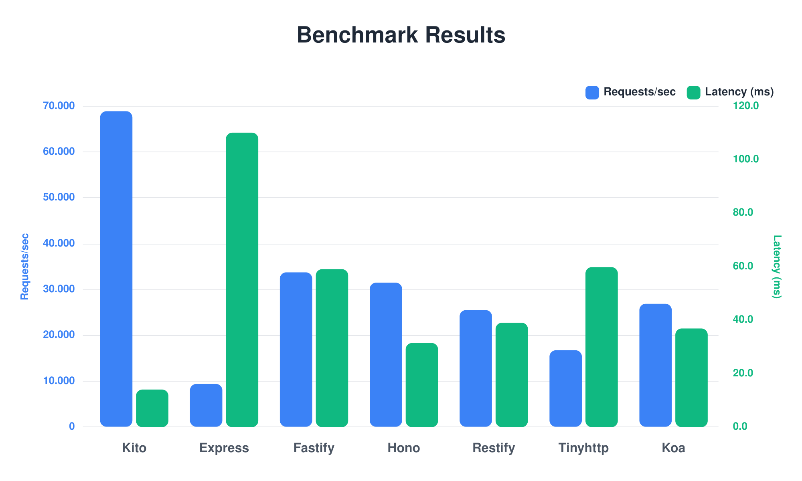

# Kito - `benchmarks`

Performance benchmarks comparing Kito against popular Node.js web frameworks.

---

## 📊 Latest Results



> **Note:** Benchmarks are automatically updated on each release.

---

## 🎯 Benchmarked Frameworks

- **Kito** - High-performance TypeScript framework written in Rust
- **Fastify** - Fast and low overhead web framework
- **Hono** - Fast web framework for the edge
- **Express** - Fast, unopinionated web framework
- **Koa** - Expressive middleware framework
- **Restify** - REST API framework
- **TinyHTTP** - Lightweight Express-like framework
- **Hapi** - Rich framework for building applications

---

## 🔧 Benchmark Configuration

```typescript
{
  connections: 100,
  pipelining: 10,
  duration: 30, // seconds
  workers: undefined // auto
}
```

All frameworks are tested with a simple "Hello World" endpoint to measure raw performance.

---

## 🚀 Running Benchmarks

### Prerequisites

```bash
pnpm install
```

### Run All Benchmarks

```bash
pnpm bench:run basic
```

This will:
1. Start each framework on sequential ports (3000, 3001, ...)
2. Run [wrk](https://github.com/wg/wrk) load tests
3. Generate comparison charts
4. Save detailed results to `results/data/`

---

## 📁 Project Structure

```
bench/
├── cases/
│   └── basic/           # Basic "Hello World" benchmarks
│       ├── kito.ts
│       ├── fastify.ts
│       ├── express.ts
│       └── ...
├── results/
│   ├── charts/          # Generated benchmark charts
│   └── data/            # Raw JSON results
├── utils/
│   ├── http.ts          # Wrk runner
│   └── chart.ts         # Chart generation
├── config.ts            # Benchmark configuration
└── runBench.ts          # Main benchmark runner
```

---

## 📈 Metrics Measured

- **Requests/sec** - Average requests per second
- **Latency (ms)** - Average response time in milliseconds
- **Throughput (bytes/sec)** - Average data throughput

---

## 🎨 Adding New Benchmarks

1. Create a new folder in `cases/` (e.g., `cases/routing/`)
2. Add framework implementations following the pattern:

```typescript
export function start(port: number): { stop: () => void } {
  const app = createServer();
  
  app.get("/", handler);
  app.listen(port);
  
  return {
    stop: async () => app.close(),
  };
}
```

3. Run your benchmark:

```bash
pnpm bench:run routing
```

---

## 📊 Understanding Results

### Requests/sec (Higher is better)
Number of requests the server can handle per second.

### Latency (Lower is better)
Time taken to receive a response. Includes network and processing time.

### Throughput (Higher is better)
Amount of data transferred per second.

---

## ⚙️ Configuration

Edit `config.ts` to customize:

```typescript
export default {
  frameworks: ["kito", "fastify", "hono", ...],
  connections: 100,      // Concurrent connections
  pipelining: 10,        // Requests per connection
  duration: 30,          // Test duration in seconds
  chart: {
    enabled: true,
    output: "results/charts/result.png"
  }
};
```

---

## 🔬 Methodology

- All tests run on the same machine with identical conditions
- Each framework uses its recommended setup and defaults
- Tests measure only the framework overhead, not business logic
- Results are averaged over the test duration

---

## 📝 Notes

- Benchmarks are indicative and may vary based on hardware
- Real-world performance depends on application complexity
- These tests measure raw throughput, not production scenarios
- All frameworks are excellent choices for different use cases

---

## 🤝 Contributing

Found an issue with the benchmarks? Want to add a new framework?

1. Fork the repository
2. Add your changes
3. Run the benchmarks locally
4. Submit a pull request

---

## 📄 License

Licensed under the [MIT License](../license).

---

[](https://blazingly.fast)
