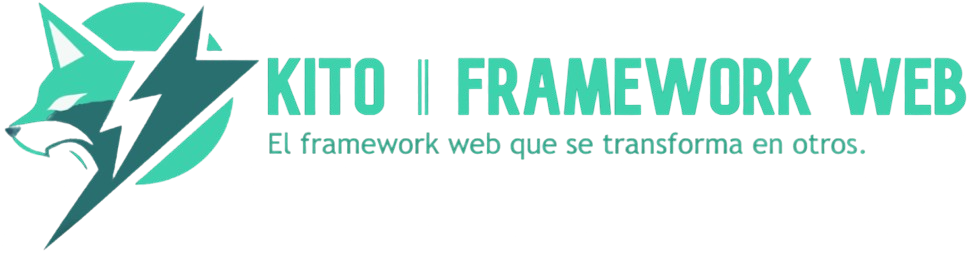

[🇺🇸 English](../../CODE_OF_CONDUCT.md) `‖` [🇪🇸 Español](../español/CODE_OF_CONDUCT.md) `‖` [🇵🇹 Português](../portugues/CODE_OF_CONDUCT.md) `‖` [🇫🇷 Français](../francais/CODE_OF_CONDUCT.md) `‖` [🇮🇹 Italiano](../italiano/CODE_OF_CONDUCT.md)

## 🥂 Nuestro Compromiso

Nosotros, los contribuyentes y mantenedores de este proyecto, nos comprometemos a crear y mantener un entorno acogedor e inclusivo para todos los participantes. Estamos comprometidos a asegurar que cada participante sea tratado con respeto y dignidad. Nos esforzamos por hacer que las contribuciones, discusiones e interacciones estén libres de acoso, discriminación y cualquier forma de abuso.

## 🌷 Nuestros Estándares

Esperamos que todos los participantes se adhieran a los siguientes estándares de comportamiento:

- **Respeto:** Trata a todos con respeto y consideración. Escuche a los demás y esté abierto a los comentarios.
- **Comunicación Constructiva:** Comunícate de manera constructiva y positiva. Las diferencias de opinión deben manejarse de manera respetuosa y productiva.
- **Inclusividad:** Fomenta y apoya la diversidad. Todos deben sentirse bienvenidos e incluidos, independientemente de su origen, identidad o nivel de experiencia.
- **Colaboración:** Trabaja en conjunto para lograr objetivos comunes. Esté dispuesto a ayudar a los demás y compartir conocimientos.
- **Profesionalismo:** Mantén una actitud profesional. Enfócate en los problemas en cuestión y evita ataques personales o comentarios despectivos.

## ❌ Comportamientos Inaceptables

Los siguientes comportamientos se consideran inaceptables.

- **Acoso:** Cualquier comportamiento que cree un entorno hostil o intimidante, incluyendo pero no limitado a comentarios ofensivos, atención no deseada o bromas discriminatorias.
- **Discriminación:** Excluir o menospreciar a otros en base a raza, etnicidad, género, orientación sexual, discapacidad, religión u otra característica.
- **Abuso:** Abuso verbal, físico o emocional, incluyendo amenazas, intimidación o acoso.
- **Suplantación:** Pretender ser otra persona o representar de manera engañosa a alguien para engañar o manipular a otros.
- **Disrupción:** Disrupción persistente de discusiones o actividades, incluyendo trolling o obstrucción deliberada del progreso del proyecto.

## ❗ Reportar Problemas

Si experimentas o eres testigo de un comportamiento que viole este Código de Conducta, por favor, repórtalo de inmediato. Puedes contactar al owner del proyecto [aquí](https://github.com/nehu3n). Todos los informes serán revisados y resueltos en la brevedad.

## 🙌🏼 Agradecimientos

Este Código de Conducta está inspirado y adaptado del [Contributor Covenant](https://www.contributor-covenant.org/), un código de conducta para proyectos de código abierto.

## 🎉 ¡Gracias!

Gracias por contribuir a este proyecto y por ayudarnos a mantener una comunidad positiva e inclusiva.
