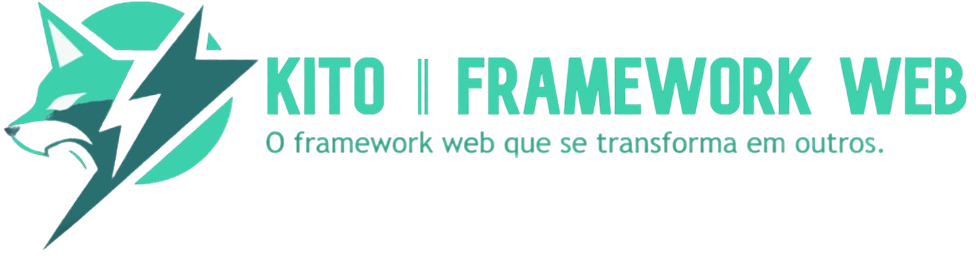

[🇺🇸 English](../english/CODE_OF_CONDUCT.md) `‖` [🇪🇸 Español](../español/CODE_OF_CONDUCT.md) `‖` [🇵🇹 Português](../portugues/CODE_OF_CONDUCT.md) `‖` [🇫🇷 Français](../francais/CODE_OF_CONDUCT.md) `‖` [🇮🇹 Italiano](../italiano/CODE_OF_CONDUCT.md)

## 🥂 Nosso Compromisso

Nós, os colaboradores e mantenedores deste projeto, nos comprometemos a criar e manter um ambiente acolhedor e inclusivo para todos os participantes. Estamos empenhados em garantir que cada participante seja tratado com respeito e dignidade. Nos esforçamos para garantir que contribuições, discussões e interações estejam livres de assédio, discriminação e qualquer forma de abuso.

## 🌷 Nossos Padrões

Esperamos que todos os participantes sigam os seguintes padrões de comportamento:

- **Respeito:** Trate todos com respeito e consideração. Escute os outros e esteja aberto a feedback.
- **Comunicação Construtiva:** Comunique-se de maneira construtiva e positiva. Discordâncias devem ser tratadas com respeito e de forma produtiva.
- **Inclusividade:** Incentive e apoie a diversidade. Todos devem se sentir bem-vindos e incluídos, independentemente de sua origem, identidade ou nível de experiência.
- **Colaboração:** Trabalhe em conjunto para alcançar objetivos comuns. Esteja disposto a ajudar os outros e compartilhar conhecimento.
- **Profissionalismo:** Mantenha uma postura profissional. Concentre-se nas questões em discussão e evite ataques pessoais ou comentários ofensivos.

## ❌ Comportamento Inaceitável

Os seguintes comportamentos são considerados inaceitáveis:

- **Assédio:** Qualquer comportamento que crie um ambiente hostil ou intimidador, incluindo, mas não limitado a, comentários ofensivos, atenção indesejada ou piadas discriminatórias.
- **Discriminação:** Excluir ou menosprezar os outros com base em raça, etnia, gênero, orientação sexual, deficiência, religião ou qualquer outra característica.
- **Abuso:** Abuso verbal, físico ou emocional, incluindo ameaças, intimidação ou bullying.
- **Falsificação de Identidade:** Fingir ser outra pessoa ou se apresentar de forma enganosa para enganar ou manipular os outros.
- **Perturbação:** Perturbação persistente de discussões ou atividades, incluindo trolling ou obstrução deliberada do progresso do projeto.

## ❗ Relatar Problemas

Se você experimentar ou testemunhar um comportamento que viole este Código de Conduta, reporte-o imediatamente. Você pode entrar em contato com os mantenedores do projeto através de [email/rastreador de issues/método de contato]. Todos os relatórios serão tratados de forma confidencial e investigados prontamente.

## 🙌 Agradecimentos

Este Código de Conduta foi inspirado e adaptado do [Contributor Covenant](https://www.contributor-covenant.org/), um código de conduta para projetos de código aberto.

## 🎉 Obrigado!

Obrigado por contribuir para este projeto e por nos ajudar a manter uma comunidade positiva e inclusiva.
